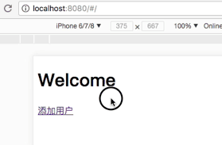
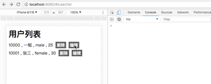

[参考](https://blog.csdn.net/awaw00)

# demo01 用户管理

## 项目搭建

新建项目
```
[demo]
  |-- webpack.config.js
  |-- package.json
  |-- src
    |-- index.js
    |-- index.html
```

安装 webpack 相关依赖
- npm i webpack webpack-cli webpack-dev-server --save-dev

安装 css 及 less 相关依赖
- npm i css-loader style-loader less less-loader --save-dev

安装 es6 相关依赖
- npm i babel-loader babel-preset-es2015 babel-core babel-preset-stage-3 --save-dev

<font color="deeppink">demo/package.json</font>
```json
{
  "name": "demo",
  "version": "1.0.0",
  "description": "",
  "scripts": {
    "dev": "webpack-dev-server --mode development",
    "build": "webpack -p"
  },
  "keywords": [],
  "author": "",
  "license": "ISC",
  "devDependencies": {
    "babel-core": "^6.26.3",
    "babel-loader": "^7.1.4",
    "babel-preset-es2015": "^6.24.1",
    "babel-preset-stage-3": "^6.24.1",
    "css-loader": "^0.28.11",
    "less": "^3.0.2",
    "less-loader": "^4.1.0",
    "style-loader": "^0.21.0",
    "webpack": "^4.6.0",
    "webpack-cli": "^2.0.15",
    "webpack-dev-server": "^3.1.3"
  }
}
```

npm run dev 启动服务

npm run build 打包

如果不加 --mode development , 则会遇到一下错误

```
WARNING in configuration
The 'mode' option has not been set. Set 'mode' option to 'development' or 'production' to enable defaults for this environment.
```

以上的警告指的是没有设定是开发模式还是生产模式,要求指定.

<font color="deeppink">demo/src/index.html</font>
```html
<!DOCTYPE html>
<html lang="en">
<head>
  <meta charset="UTF-8">
  <meta name="viewport" content="width=device-width, initial-scale=1.0">
  <meta http-equiv="X-UA-Compatible" content="ie=edge">
  <title>Document</title>
</head>
<body>
  <script src='./app.js'></script>
</body>
</html>
```

<font color="deeppink">demo/src/index.js</font>
```js
console.log(1111111)
```

<font color="deeppink">demo/webpack.config.js</font>
```js
var webpack = require('webpack');
module.exports = {
  entry: './src/index.js', // 入口文件地址
  output: {
    path: __dirname + "/build", // 打包后的文件存放路径
    filename: 'app.js', // 输出的文件名字
  },
  module: {
    rules: [
      {
        test: /\.js$/,  // js-loader
        loader: 'babel-loader?presets=es2015&presets[]=stage-3'
      },
      {
        test: /\.css$/, // css-loader
        loader: "style-loader!css-loader"
      },
      {
        test: /\.less/, // less-loader
        loaders: 'style-loader!css-loader!less-loader'
      }
    ],
  },
  devServer: { // webpack-dev-server 的配置
    inline: true,
    hot: true,
    contentBase: ['./build', './src'],
  },
  plugins: [
    new webpack.HotModuleReplacementPlugin(), // 启用热替换模块
  ]
}
```

[webpack 具体参考戳这里](http://www.cnblogs.com/sakurayeah/p/7837314.html)

执行 npm run dev 启动项目, 打开 http://localhost:8080/ 效果如下


contentBase 告诉服务器从哪里提供内容

output 里设置了将 入口文件 demo/src/index.js 打包到 build 文件夹下去，而 index.html 则在 demo/src 文件夹下，因此需要设置 build 和 src

如果 contentBase 的值写成 './build' （contentBase: './build'），效果如下


contentBase 字段设定的是 build 文件夹，而这里并没有将 demo/src/index.html 打包到 demo/build 文件夹下去，因此在 build 文件夹下找不到 index.html

执行 npm run build , 则生成 demo/build/app.js


## 引入 react 和 单独打包 html


安装 react 相关依赖
- npm i react react-dom --save
- npm i babel-preset-react --save-dev

安装 html 打包依赖
- npm i html-webpack-plugin --save-dev

<font color="deeppink">demo/package.json</font> 新增的部分如下所示
```json
{
  "devDependencies": {
    "html-webpack-plugin": "^3.2.0",
  },
  "dependencies": {
    "react": "^16.3.2",
    "react-dom": "^16.3.2"
  }
}
```

<font color="deeppink">demo/webpack.config.js</font>
```js
var webpack = require('webpack');
var HtmlWebpackPlugin = require('html-webpack-plugin');

module.exports = {
  entry: './src/index.js', // 入口文件地址
  output: {
    path: __dirname + "/build", // 打包后的文件存放路径
    filename: 'app.js', // 输出的文件名字
  },
  module: {
    rules: [
      {
        test: /\.js$/,  // js-loader
        loader: 'babel-loader?presets=es2015&presets[]=react&presets[]=stage-3'
      },
      {
        test: /\.css$/, // css-loader
        loader: "style-loader!css-loader"
      },
      {
        test: /\.less/, // less-loader
        loaders: 'style-loader!css-loader!less-loader'
      }
    ],
  },
  devServer: { // webpack-dev-server 的配置
    inline: true,
    hot: true,
    contentBase: './build',
  },
  plugins: [
    new webpack.HotModuleReplacementPlugin(), // 启用热替换模块
    new HtmlWebpackPlugin({
      template: './src/index.html',
    })
  ]
}
```

需要 babel-preset-react 插件来编译 React, 在 js-loader 后需要加上 presets[]=react 才能解析 react

new HtmlWebpackPlugin() 里的 template 字段：需要打包的 html 的文件路径

这里由于我们将 html 文件会单独打包去 build 文件下，因此 devServer.contentBase 只需要改为 './build' 即可

<font color="deeppink">demo/src/index.html</font>
```html
<!DOCTYPE html>
<html lang="en">
<head>
  <meta charset="UTF-8">
  <meta name="viewport" content="width=device-width, initial-scale=1.0">
  <meta http-equiv="X-UA-Compatible" content="ie=edge">
  <title>Document</title>
</head>
<body>
  <div id="root"></div>
</body>
</html>
```

在打包 html 的时候会自动引入 app.js, 因此这里不需要再引入

<font color="deeppink">demo/src/index.js</font>
```js
import React from 'react';
import ReactDOM from 'react-dom';

const Init = () => <div>Hello</div>;

ReactDOM.render(
  <Init />,
  document.getElementById('root'),
);
```

效果如下


## 引入路由

安装 router 相关
- npm i react-router-dom --save-dev

<font color="deeppink">demo/package.json</font> 新增的部分如下所示
```json
{
  "devDependencies": {
    "react-router-dom": "^4.2.2",
  },
}
```

新建文件如下
```
[demo]
  |--src
    |-- routers
      |-- index.js
    |-- components
      |-- userAdd.js
```

写一个简单的 react 组件: 添加用户

<font color="deeppink">demo/src/components/userAdd.js</font>
```js
import React from 'react';

const UserAdd = () => <div>User add</div>;

export default UserAdd;
```

<font color="deeppink">demo/src/routers/index.js</font>
```js
import React from 'react';
import { HashRouter, Route, Switch } from 'react-router-dom';
import UserAdd from '../components/userAdd';

const Init = () =>
  <HashRouter>
    <Route path="/user/add" component={UserAdd} />
  </HashRouter>;

export default Init;
```

用路由来控制页面的渲染，这里配了一个 /user/add 路由

<font color="deeppink">demo/src/index.js</font>
```js
import React from 'react';
import ReactDOM from 'react-dom';
import Init from './routers/index';

ReactDOM.render(
  <Init />,
  document.getElementById('root'),
);
```

这时候打开 http://localhost:8000 发现页面一片空白，这是因为只配了一个/user/add的路由

打开 http://localhost:8080/#/user/add 就能看到如下效果


> 当打开 http://localhost:8000 时，浏览器里出现的是 http://localhost:8000/#/
> 这里用的是 hashHistory, url中’#’及’#’以后的部分属于hash，hash的变化并不会引起页面的重新刷新，而 hashHistory 会监听hash的变化使得Router组件能够根据url渲染出正确的组件


## 添加 home

现在来写一个 Home 组件，并且可以跳转到 添加用户 页面

```
[demo]
  |-- src
    |-- components
      |-- home.js
```

<font color="deeppink">demo/src/components/home.js</font>
```js
import React from 'react';
import { Link } from 'react-router-dom';

const Home = () => <div>
    <header>
      <h1>Welcome</h1>
    </header>
    <main>
      <Link to="/user/add">添加用户</Link>
    </main>
  </div>;

export default Home;
```

这里用了 Link 来进行跳转，当然，也可以写成 \<a href=”/#/user/add”\>添加用户\</a\>

但是，当我们把 hashHistory 换成 browserHistory 的时候就要把’#’去掉，使用 Link 则可以无视这种差别，并且阻止页面跳转，仅仅是改变了url 和 改变了渲染的组件

添加 Home 组件的路由

<font color="deeppink">demo/src/routers/index.js</font>
```js
import React from 'react';
import { HashRouter, Route, Switch } from 'react-router-dom';
import Home from '../components/home';
import UserAdd from '../components/userAdd';

const Init = () =>
  <HashRouter>
    <div>
      <Route path="/" component={Home}/>
      <Route path="/user/add" component={UserAdd} />
    </div>
  </HashRouter>;

export default Init;
```

> 注意：这里如果不将 Route 包在 div 内，则会报错 “A \<Router\> may have only one child element”

打开 http://localhost:8080 效果如下



现在 首页 可以正常访问，但是在点击跳转 添加用户 页面的时候，我们发现首页的内容依旧存在

我们想要的效果应该是类似跳转了另一个页面，那就要做如下改造

<font color="deeppink">demo/src/routers/index.js</font>
```js
import React from 'react';
import { HashRouter, Route, Switch } from 'react-router-dom';
import Home from '../components/home';
import UserAdd from '../components/userAdd';

const Init = () =>
  <HashRouter>
    <div>
      <Route exact path="/" component={Home}/>
      <Route path="/user/add" component={UserAdd} />
    </div>
  </HashRouter>;

export default Init;
```

react 路由会匹配所有匹配到的路由组价，exact 能够使得路由的匹配更严格一些。

exact 的值为 bool 型，为 true 是表示严格匹配，为 false 时为正常匹配。

如在 exact 为 true时，’/link’与’/’是不匹配的，但是在 false 的情况下它们又是匹配的。

因此，如果不加 exact 的时候，/user/add 也会把 Home 展示出来

效果如下


## 编写 userAdd 页面的样式

新增文件如下
```
[demo]
  |-- src
    |-- common
      |-- reset.less
    |-- components
      |-- userAdd.less
```

先添加一份 reset.less （可以根据需要自己去写）

<font color="deeppink">demo/src/common/reset.less</font>
```less
html, body, div, span, 
h1, h2, h3, h4, h5, h6, p,
a, em, img, b, u, i, dl, dt, dd, ol, ul, li, form, label, legend,
article, aside, details, footer, header, menu, nav, section, summary{
	margin: 0;
	padding: 0;
}
article, aside, details, figcaption, figure, 
footer, header, hgroup, menu, nav, section {
	display: block;
}
ol, ul {
	list-style: none;
}
blockquote, q {
	quotes: none;
}
blockquote:before, blockquote:after,
q:before, q:after {
	content: '';
	content: none;
}
input, select, button {
  border: 1px solid #aaa;
  outline: none;
}
```

<font color="deeppink">demo/src/components/userAdd.less</font>
```less
.user-add-wrap {
  padding: 10px;
  li {
    padding-top: 10px;
  }
  button {
    padding: 5px 10px;
    margin-top: 10px;
    background: #aaa;
  }
}
```

<font color="deeppink">demo/src/components/userAdd.js</font>
```js
import React from 'react';
import './userAdd.less';

const UserAdd = () => <div className="user-add-wrap">
    <h1>添加用户</h1>
    <ul>
      <li>
        <label>用户名：</label>
        <input type="text"/>
      </li>
      <li>
        <label>年龄：</label>
        <input type="number"/>
      </li>
      <li>
        <label>性别：</label>
        <select>
          <option value="">请选择</option>
          <option value="male">男</option>
          <option value="female">女</option>
        </select>
      </li>
    </ul>
    <button>提交</button>
  </div>;

export default UserAdd;
```

这里我们需要获取 用户名、年龄、性别 三个字段

效果如下


## 获取用户信息

下面我们就要点击提交按钮的时候，获取用户的信息

<font color="deeppink">demo/src/components/userAdd.js</font>
```js
import React from 'react';
import './userAdd.less';

class UserAdd extends React.Component {
  constructor () {
    super();
    this.state = {
      // 设置 用户名、年龄、性别 的初始值
      name: '',
      age: '',
      gender: ''
    };
  }
  valChange(type, val) {
    this.setState({
      [type]: val
    })
  }
  submitBtn() {
    console.log(this.state)
  }
  render() {
    const {name, age, gender} = this.state;
    return (
      <div className="user-add-wrap">
        <h1>添加用户</h1>
        <ul>
          <li>
            <label>用户名：</label>
            <input value={name} type="text" onChange={(e) => this.valChange('name', e.target.value)}/>
          </li>
          <li>
            <label>年龄：</label>
            <input value={age} type="number" onChange={(e) => this.valChange('age', e.target.value)}/>
          </li>
          <li>
            <label>性别：</label>
            <select value={gender} onChange={(e) => this.valChange('gender', e.target.value)}>
              <option value="">请选择</option>
              <option value="male">男</option>
              <option value="female">女</option>
            </select>
          </li>
        </ul>
        <button onClick={() => this.submitBtn()}>提交</button>
      </div>
    )
  }
}
export default UserAdd;
```

效果如下


name、age、gender 的值，都从 state 里获取

通过 onChange 事件，来监听他们值的改变，并且通过 setState 来更新值

在点击按钮的时候，可以观察到最终填写的值


## 调用接口，创建用户

安装 mockjs 相关依赖
- npm i mockjs --save-dev

安装 jquery 相关依赖
- npm i jquery --save

<font color="deeppink">demo/package.json</font> 新增的部分如下所示
```json
{
  "devDependencies": {
    "mockjs": "^1.0.1-beta3",
  },
  "dependencies": {
    "jquery": "^3.3.1",
  }
}
```

这里用 mockjs 来模拟后台返回，[mockjs 文档戳这里](https://github.com/nuysoft/Mock/wiki)

新增文件如下
```
[demo]
  |-- mock
    |-- mock.js
```


<font color="deeppink">demo/webpack.config.js</font> 新增环境变量信息
```js
module.exports = {
  plugins: [
    new webpack.DefinePlugin({
      'process.env': {
          NODE_ENV: '"mock"'
      }
    })
  ]
}
```

[环境变量 详细讲解可以戳这里 查看标题十八](http://www.cnblogs.com/sakurayeah/p/8109978.html)


<font color="deeppink">demo/src/components/userAdd.js</font>
```js
import React from 'react';
import $ from 'jquery';
import './userAdd.less';

if (process.env.NODE_ENV === 'mock') {
  console.log('process.env.NODE_ENV',process.env.NODE_ENV)
  require('../../mock/mock.js');
}

class UserAdd extends React.Component {
  constructor () {
    super();
    this.state = {
      // 设置 用户名、年龄、性别 的初始值
      name: '',
      age: '',
      gender: ''
    };
  }
  valChange(type, val) {
    this.setState({
      [type]: val
    })
  }
  submitBtn() {
    const self = this;
    $.ajax({
      url: 'userAdd.json',
      type: "POST",
      dataType: 'json',
      data: self.state,
      success:(data) => {
        if (data.success && data.id) {
          console.log('添加用户成功', data)
        } else {
          console.log('添加用户失败', data)
        }
      },
      error: (data) => {
        console.log('添加用户失败', data)
      }
    })
  }
  render() {
    const {name, age, gender} = this.state;
    return (
      <div className="user-add-wrap">
        <h1>添加用户</h1>
        <ul>
          <li>
            <label>用户名：</label>
            <input value={name} type="text" onChange={(e) => this.valChange('name', e.target.value)}/>
          </li>
          <li>
            <label>年龄：</label>
            <input value={age} type="number" onChange={(e) => this.valChange('age', e.target.value)}/>
          </li>
          <li>
            <label>性别：</label>
            <select value={gender} onChange={(e) => this.valChange('gender', e.target.value)}>
              <option value="">请选择</option>
              <option value="male">男</option>
              <option value="female">女</option>
            </select>
          </li>
        </ul>
        <button onClick={() => this.submitBtn()}>提交</button>
      </div>
    )
  }
}
export default UserAdd;
```


点击提交按钮的时候，去请求 user.json , 并且将 name、age、gender 信息传过去。

当拿到请求返回的信息，success 为 true , 并且 id 存在时，才算成功

<font color="deeppink">demo/mock/mock.js</font>
```js

const Mock = require('mockjs');

let userData = [
  {
    "id": 10000,
    "name": "一韬",
    "age": "25",
    "gender": "male"
  },
  {
    "id": 10001,
    "name": "张三",
    "age": "30",
    "gender": "female"
  }
]

// 模拟 添加用户 的后台返回
Mock.mock(/userAdd.json/, 'post', function(options) {
  console.log(options, userData);

  const {
    body
  } = options;

  // 用作放新用户的信息
  const newUser = {};

  // 取最后一个用户的id，加一，当做新增用户的id
  newUser.id = userData[userData.length - 1].id + 1;

  // 用作标记请求是否失败
  let err = false;

  body.split('&').map((v) => {
    const bodyItem = v.split('=');
    // 将传过来的 name、age、gender 放入 newUser 里
    if (bodyItem[0] && bodyItem[1]) {
      // 中文的名字要进行 解码
      if (bodyItem[0] === 'name') {
        bodyItem[1] = decodeURI(bodyItem[1])
      }
      newUser[bodyItem[0]] = bodyItem[1];
    // 如果上面传的内容不存在，则当做请求失败
    } else {
      err = true;
    }
  });

  // err 为 true 时，模拟请求失败的情况
  if (err) {
    return {
      success: false
    }
  }

  // 当请求成功时，将新增的用户信息放入 userData
  userData.push(newUser);

  // 请求成功时，返回用户 id
  return {
    id: newUser.id,
    success: true,
  };
})
```

Mock.mock(rurl, rtype, function( options ))

rurl：表示需要拦截的 URL

rtype： 表示需要拦截的 Ajax 请求类型。例如 GET、POST、PUT、DELETE 等

function( options )：表示用于生成响应数据的函数。options 指向本次请求的 Ajax 选项集，含有 url、type 和 body 三个属性

效果如下所示：


分析如下

userData 是用来存储用户的数据。


拿到这个值以后，我们可以对比 userData 里的格式，应该要组装成下面这样
```js
{
  name: 'ac',
  age: '12',
  gender: 'female',
  id: 10002
}
```


当 err 为 true 时，直接返回 success 为 false，请求异常。

当 err 为 false 时，请求成功，将拼接好的 newUser 放入 userData，并返回 success 为 true 和 新生成的用户 id

因此我们看到效果图里，第一次提交时，全部信息填写了，返回成功，并且 userData 最终变成如下结果
```js
[
  {id: 10000, name: "一韬", age: "25", gender: "male"}
  {id: 10001, name: "张三", age: "30", gender: "female"}
  {id: 10002, name: "ac", age: "12", gender: "female"}
]
```

第二次提交时，没有填写用户年龄，返回请求异常，这一条异常的数据也没有被写入到 userData 中。


## 对添加的用户信息做验证

<font color="deeppink">demo/src/components/userAdd.js</font>
```js
import React from 'react';
import $ from 'jquery';
import './userAdd.less';

if (process.env.NODE_ENV === 'mock') {
  console.log('process.env.NODE_ENV',process.env.NODE_ENV)
  require('../../mock/mock.js');
}

class UserAdd extends React.Component {
  constructor () {
    super();
    this.state = {
      // 设置 用户名、年龄、性别 的初始值
      name: {
        val: '', // 该表单具体的值
        error: '' // 错误提示信息
      },
      age: {
        val: '',
        error: ''
      },
      gender: {
        val: '',
        error: ''
      }
    };
  }
  valChange(type, val) {
    // type : name | age | gender
    // val 表单的值

    // 用于存储新的表单信息
    const newTypeObj = {
      val, 
      error: ''
    };

    switch (type) {
      case 'name': {
        if (val.length >= 5) {
          newTypeObj.error = '用户名最多4个字符';
        } else if (val.length === 0) {
          newTypeObj.error = '请输入用户名';
        }
        break;
      }
      case 'age': {
        if (Number(val) <= 0) {
          newTypeObj.error = '请输入大于0的数字';
        }
        break;
      }
      case 'gender': {
        if (!val) {
          newTypeObj.error = '请选择性别';
        }
        break;
      }
    }

    this.setState({
      [type]: newTypeObj
    })
  }
  submitBtn() {
    const self = this;
    const {name, age, gender} = this.state;

    if (name.error || age.error || gender.error) {
      alert('请填写正确的信息后重试');
      console.log('添加用户 填写信息有误', this.state)
      return;
    }

    $.ajax({
      url: 'userAdd.json',
      type: "POST",
      dataType: 'json',
      data: {
        name: name.val,
        age: age.val,
        gender: gender.val
      },
      success:(data) => {
        if (data.success && data.id) {
          console.log('添加用户成功', data)
          // 当添加成功后，清空表单的内容
          self.setState({
            // 设置 用户名、年龄、性别 的初始值
            name: {
              val: '', // 该表单具体的值
              error: '' // 错误提示信息
            },
            age: {
              val: '',
              error: ''
            },
            gender: {
              val: '',
              error: ''
            }
          })
        } else {
          console.log('添加用户失败', data)
        }
      },
      error: (data) => {
        console.log('添加用户失败', data)
      }
    })
  }
  render() {
    const {name, age, gender} = this.state;
    return (
      <div className="user-add-wrap">
        <h1>添加用户</h1>
        <ul>
          <li>
            <label>用户名：</label>
            <input value={name.val} type="text" onChange={(e) => this.valChange('name', e.target.value)}/>
            {name.error && <span>{name.error}</span>}
          </li>
          <li>
            <label>年龄：</label>
            <input value={age.val} type="number" onChange={(e) => this.valChange('age', e.target.value)}/>
            {age.error && <span>{age.error}</span>}
          </li>
          <li>
            <label>性别：</label>
            <select value={gender.val} onChange={(e) => this.valChange('gender', e.target.value)}>
              <option value="">请选择</option>
              <option value="male">男</option>
              <option value="female">女</option>
            </select>
            {gender.error && <span>{gender.error}</span>}
          </li>
        </ul>
        <button onClick={() => this.submitBtn()}>提交</button>
      </div>
    )
  }
}
export default UserAdd;
```

效果如下


分析如下

- constructor 函数里
  对 state 的结构进行了修改，name 、age、gender 都包含了 val 和 error

  error 表示报错信息，val 表示对应的值

- render 函数里


- valChange 函数里
 根据 type (name | age | gender)，去做不同的包若信息处理，将新的 val 和新的 error 更新到state里

- submitBtn 函数里

  最后在点击提交的时候，对 name, age, gender 是否有报错信息进行了校验，如果有报错信息，说明没有填写正确的内容，没有报错信息就可以正常发送 user.json 请求。

  这里当 userAdd.json 请求成功时，还将表单的各个项设置为初始化的内容


## 高阶组件

adduser 是用来添加用户的，那再来一个添加 图书的 组件，就会发现里面有很多代码都是重复的部分，这时候就可以提取出来。

首先对 表单的字段、默认值、校验规则、错误信息 来进行提取。

首先约定下上面这些类似部分信息的传递格式
```js
const types = {
  name: {
    defaultValue: '', // 默认值
    rules: [
      {
        pattern: function (value) { // 校验规则, function | RegExp , 返回 true 则校验通过
          return value.length > 0;
        },
        error: '请输入用户名' // 每个 pattern 对应一个 error 信息
      },
      {
        pattern: /^.{1,4}$/,
        error: '用户名最多4个字符'
      }
    ]
  }
}
```

name 表示的是表单的字段（age、gender）

defaultValue 表单的默认值

rules 里包含了 校验规则 和 错误信息

pattern 可以是函数和正则，返回为 true 时校验成功，返回为 false 时校验失败，并且展示 error 的内容

新增文件如下
```
[demo]
  |-src
    |-- components
      |-- formProvider.js
```

<font color="deeppink">demo/src/components/formProvider</font>
```js
import React from 'react';

const formProvider = (types) => (Comp) => {

    const initialFormState = {};
    // 处理初始需要的 fromData
    for (const key in types) {
      initialFormState[key] = {
        val: types[key].defaultValue,
        error: ''
      };
    }

    class FormComponent extends React.Component {
      constructor (props) {
        super(props);
        this.state = {
          formData: initialFormState,
          formValid: false // 用来保存整个表单的校验状态
        };
      }
      valChange (typeName, value) {
        const { formData } = this.state;

        const newFieldState = {val: value, error: ''};

        const typeRules = types[typeName].rules;

        for (let i = 0; i < typeRules.length; i++) {
          const {
            pattern,
            error
          } = typeRules[i];

          let valid = false;
          if (typeof pattern === 'function') {
            valid = pattern(value);
          } else {
            valid = pattern.test(value);
          }

          if (!valid) {
            newFieldState.error = error;
            break;
          }
        }

        const newForm = {...formData, [typeName]: newFieldState};

        let formValid = false;
        // 当有 error 时，将 formValid 设置为 true
        Object.values(newForm).every(f => {
          if (f.error) {
            formValid = true
          }
        })
        
        this.setState({
          formData: newForm,
          formValid,
        });
      }
      render () {
        const {formData, formValid} = this.state;
        return <Comp {...this.props} formData={formData} formValid={formValid} onFormChange={(typeName, value) => this.valChange(typeName, value)}/>
      }
    }

    return FormComponent;
}

export default formProvider;
```

把里面的逻辑都拿掉，就可以清晰的看到如下
```js
const formProvider = (types) => (Comp) => {
  class FormComponent extends React.Component {
    render () {
      return <Comp />
    }
  }
  return FormComponent;
}
```

不用箭头函数写，如下所示，这么看起来更加清晰
```js
function formProvider (fields) {
  return function (Comp) {
    class FormComponent extends React.Component {
      render () {
        return (
          <Comp />
        );
      }
    }
    return FormComponent;
  }
}
```

formProvider 接收一个 types(就是我们上面约定 信息的传递格式) 参数，并返回一个函数，这个函数接收一个组件 Comp 作为参数并返回一个组件 FormComponent


FormComponent 组件 constructor 函数里，设置了初始的 state (formData 和 formValid)，formData 是对应表单的初始化值和错误信息，formValid(默认值是 false) 用来保存整个表单的校验状态，

FormComponent 组件 valChange 函数，是当值发生改变是调用的，里面对值是否合法做了校验。当结果不合法时，给出对应的值的报错信息，并且将 formValid 设置为 true。

formProvider 的用法是这样的：
```js
class UserAdd extends React.Component {};
const types = {
  name: {},
  age: {},
}
export default formProvider(types)(UserAdd);
```

经过 formProvider 处理后的 UserAdd 组件会得到额外的 props: form、formValid、onFormChange

<font color="deeppink">demo/src/components/userAdd.js</font>
```js
import React from 'react';
import $ from 'jquery';
import formProvider from './formProvider';
import './userAdd.less';

if (process.env.NODE_ENV === 'mock') {
  console.log('process.env.NODE_ENV',process.env.NODE_ENV)
  require('../../mock/mock.js');
}

class UserAdd extends React.Component {
  submitBtn() {
    const self = this;
    const {formData: {name, age, gender}, formValid} = this.props;

    if (formValid) {
      alert('请填写正确的信息后重试');
      console.log('添加用户 填写信息有误', {name, age, gender})
      return;
    }

    $.ajax({
      url: 'userAdd.json',
      type: "POST",
      dataType: 'json',
      data: {
        name: name.val,
        age: age.val,
        gender: gender.val
      },
      success:(data) => {
        if (data.success && data.id) {
          console.log('添加用户成功', data)
        } else {
          console.log('添加用户失败', data)
        }
      },
      error: (data) => {
        console.log('添加用户失败', data)
      }
    })
  }
  render() {
    const {formData: {name, age, gender}, onFormChange} = this.props;
    return (
      <div className="user-add-wrap">
        <h1>添加用户</h1>
        <ul>
          <li>
            <label>用户名：</label>
            <input value={name.val || ''} type="text" onChange={(e) => onFormChange('name', e.target.value)}/>
            {name.error && <span>{name.error}</span>}
          </li>
          <li>
            <label>年龄：</label>
            <input value={age.val} type="number" onChange={(e) => onFormChange('age', e.target.value)}/>
            {age.error && <span>{age.error}</span>}
          </li>
          <li>
            <label>性别：</label>
            <select value={gender.val} onChange={(e) => onFormChange('gender', e.target.value)}>
              <option value="">请选择</option>
              <option value="male">男</option>
              <option value="female">女</option>
            </select>
            {gender.error && <span>{gender.error}</span>}
          </li>
        </ul>
        <button onClick={() => this.submitBtn()}>提交</button>
      </div>
    )
  }
}

const types = {
  name: {
    defaultValue: '',
    rules: [
      {
        pattern: function (value) {
          return value.length > 0;
        },
        error: '请输入用户名'
      },
      {
        pattern: /^.{1,4}$/,
        error: '用户名最多4个字符'
      }
    ]
  },
  age: {
    defaultValue: '',
    rules: [
      {
        pattern: function (value) {
          return Number(value) > 0;
        },
        error: '请输入大于0的数字'
      }
    ]
  },
  gender: {
    defaultValue: '',
    rules: [{
      pattern: function (value) {
        return !!value;
      },
      error: '请选择性别'
    }]
  }
}

export default formProvider(types)(UserAdd);
```

UserAdd 组件 render 函数里，每个表单的 value 的值 和 onChange 的函数，都改成从 this.props 里取

UserAdd 组件 submitBtn 函数里，之前是通过 name.error、age.error、gender.error 是否存在来判断是否验证通过，现在这个判断改为在 formProvider 里做了，只需要通过 formValid 来进行判断

效果和上面一样


## 表单控件组件

上面抽离了表单的状态的维护和更新逻辑，下面来对 render 里重复的代码进行抽离

表单的每个控件包含了：label、表单控件(input、select)、error

新增文件如下
```
[demo]
  |-- src
    |-- components
      |-- formItem.js
```
将这部分公用的封装成一个FormItem组件

<font color="deeppink">demo/src/components/formItem.js</font>
```js
import React from 'react';

class FormItem extends React.Component {
  render () {
    const {label = '', children = '', error = '', className = ''} = this.props;
    return (
      <div className={className}>
        <label>{label}</label>
        {children}
        {error && <span>{error}</span>}
      </div>
    );
  }
}

export default FormItem;
```

在UserAdd.js中使用FormItem组件

<font color="deeppink">demo/src/components/userAdd.js</font>
```js
import React from 'react';
import $ from 'jquery';
import formProvider from './formProvider';
import FormItem from './formItem';
import './userAdd.less';

if (process.env.NODE_ENV === 'mock') {
  console.log('process.env.NODE_ENV',process.env.NODE_ENV)
  require('../../mock/mock.js');
}

class UserAdd extends React.Component {
  submitBtn() {
    const self = this;
    const {formData: {name, age, gender}, formValid} = this.props;

    if (formValid) {
      alert('请填写正确的信息后重试');
      console.log('添加用户 填写信息有误', {name, age, gender})
      return;
    }

    $.ajax({
      url: 'userAdd.json',
      type: "POST",
      dataType: 'json',
      data: {
        name: name.val,
        age: age.val,
        gender: gender.val
      },
      success:(data) => {
        if (data.success && data.id) {
          console.log('添加用户成功', data)
        } else {
          console.log('添加用户失败', data)
        }
      },
      error: (data) => {
        console.log('添加用户失败', data)
      }
    })
  }
  render() {
    const {formData: {name, age, gender}, onFormChange} = this.props;
    return (
      <div className="user-add-wrap">
        <h1>添加用户</h1>
        <FormItem label="用户名：" error={name.error} className="form-item-wrap">
          <label></label>
          <input value={name.val || ''} type="text" onChange={(e) => onFormChange('name', e.target.value)}/>
        </FormItem>
        <FormItem label="年龄：" error={age.error} className="form-item-wrap">
          <input value={age.val} type="number" onChange={(e) => onFormChange('age', e.target.value)}/>
        </FormItem>
        <FormItem label="性别：" error={gender.error} className="form-item-wrap">
          <select value={gender.val} onChange={(e) => onFormChange('gender', e.target.value)}>
            <option value="">请选择</option>
            <option value="male">男</option>
            <option value="female">女</option>
          </select>
        </FormItem>
        <button onClick={() => this.submitBtn()}>提交</button>
      </div>
    )
  }
}

const types = {
  name: {
    defaultValue: '',
    rules: [
      {
        pattern: function (value) {
          return value.length > 0;
        },
        error: '请输入用户名'
      },
      {
        pattern: /^.{1,4}$/,
        error: '用户名最多4个字符'
      }
    ]
  },
  age: {
    defaultValue: '',
    rules: [
      {
        pattern: function (value) {
          return Number(value) > 0;
        },
        error: '请输入大于0的数字'
      }
    ]
  },
  gender: {
    defaultValue: '',
    rules: [{
      pattern: function (value) {
        return !!value;
      },
      error: '请选择性别'
    }]
  }
}

export default formProvider(types)(UserAdd);
```

<font color="deeppink">demo/src/components/userAdd.less</font>
```less
.user-add-wrap {
  padding: 10px;
  .form-item-wrap {
    padding-top: 10px;
  }
  button {
    padding: 5px 10px;
    margin-top: 10px;
    background: #aaa;
  }
}
```

效果和上面一样


## 渲染用户列表

新增一个用户列表的页面，来展示全部用户信息

新增文件如下
```
[demo]
  |-- src
    |-- components
      |-- userList.js
```

<font color="deeppink">demo/src/components/userList.js</font>
```js
import React from 'react';

const UserList = () => <div>userList</div>;

export default UserList;
```

添加指向这个页面的路由
<font color="deeppink">demo/src/routers/index.js</font>
```js
import React from 'react';
import { HashRouter, Route, Switch } from 'react-router-dom';
import Home from '../components/home';
import UserAdd from '../components/userAdd';
import UserList from '../components/userList';

const Init = () =>
  <HashRouter>
    <div>
      <Route exact path="/" component={Home}/>
      <Route path="/user/add" component={UserAdd} />
      <Route path="/user/list" component={UserList} />
    </div>
  </HashRouter>;

export default Init;
```

打开 http://localhost:8080/#/user/list 效果如下


在 home 里增加 userList 的跳转按钮

<font color="deeppink">demo/src/components/home.js</font>
```js
import React from 'react';
import { Link } from 'react-router-dom';

const Home = () => <div>
    <header>
      <h1>Welcome</h1>
    </header>
    <main>
      <Link to="/user/add">添加用户</Link>
      <br />
      <Link to="/user/list">用户列表</Link>
    </main>
  </div>;

export default Home;
```

打开 http://localhost:8080 效果如下


新增获取用户列表的 mock 

<font color="deeppink">demo/mock/mock.js</font> 新增部分如下
```js
...
// 模拟 获取用户列表 的后台返回
Mock.mock(/userList.json/, 'post', function(options) {
  console.log(options, userData);

  // 请求成功时，返回用户列表
  return {
    data: userData,
    success: true,
  };
});
```

请求 userList.json 接口时，将返回 userData

<font color="deeppink">demo/src/components/userList.js</font>
```js
import React from 'react';
import $ from 'jquery';

class UserList extends React.Component {
  constructor (props) {
    super(props);
    this.state = {
      userList: []
    };
  }

  componentDidMount () {
    const self = this;
    $.ajax({
      url: 'userList.json',
      type: 'GET',
      dataType: 'json',
      success: (res = {}) => {
        const { data } = res;
        self.setState({
          userList: data
        });
      }
    })
  }

  render () {
    const { userList = [] } = this.state;
    return (
      <div>
        <h1>用户列表</h1>
        <ul>
          {
            userList.map(user => (
              <li key={user.id}>{user.id} , {user.name} , {user.gender} , {user.age}</li>
            ))
          }
        </ul>
      </div>
    )
  }
}

export default UserList;
```

UserList 组件 componentDidMount 函数里，调用 userList.json 接口来获取用户列表，并把获取到的数据存放到组件的 state 中

在 render 方法中，使用数组的 map 方法将 userList 里的每个用户信息展示出来

打开 http://localhost:8080/#/user/list 效果如下


下面我们来做 当在 userAdd 页面，点击提交按钮，相应成功时，则跳转 userList 页面

<font color="deeppink">demo/src/components/userAdd.js</font>
```js
class UserAdd extends React.Component {
  submitBtn() {
    const self = this;
    ...

    $.ajax({
      url: 'userAdd.json',
      type: "POST",
      dataType: 'json',
      data: { ... },
      success:(data) => {
        if (data.success && data.id) {
          console.log('添加用户成功', data);
          self.props.history.push('/user/list');
        } else {
          console.log('添加用户失败', data)
        }
      },
      error: () => { ... }
    })
  }
  render () { ... }
}
```

添加用户之后，使用 this.props.history.push 方法来跳转到用户列表页面

效果如下


## 提取布局组件

现在观察我们三个页面（userAdd、userList、home），会发现页面都是由 标题 和 内容 两个部分组成，那这两块也可以提取出来

新增文件如下
```
[demo]
  |-- src
    |-- components
      |-- homeLayout.js
```


<font color="deeppink">demo/src/components/homeLayout.js</font>
```js
import React from 'react';

class HomeLayout extends React.Component {
  render () {
    const {title = '', children = '', className = ''} = this.props;
    return (
      <div className={className}>
        <h1>{title}</h1>
        <main>
          {children}
        </main>
      </div>
    );
  }
}

export default HomeLayout;
```

使用 props.title 来维护页面的标题文本，使用 props.children 来渲染每个页面特有的内容部分

home 页面的重构

<font color="deeppink">demo/src/components/home.js</font>
```js
import React from 'react';
import { Link } from 'react-router-dom';
import HomeLayout from './homeLayout';

const Home = () =>
  <HomeLayout title="Welcome">
    <Link to="/user/add">添加用户</Link>
    <br />
    <Link to="/user/list">用户列表</Link>
  </HomeLayout>;

export default Home;
```

userAdd 页面的重构

<font color="deeppink">demo/src/components/userAdd.js</font> 这里只写 render 部分
```js
...
import HomeLayout from './homeLayout';

class UserAdd extends React.Component {
  submitBtn(){...}
  render() {
    const {formData: {name, age, gender}, onFormChange} = this.props;
    return (
      <HomeLayout className="user-add-wrap" title="添加用户">
        <FormItem label="用户名：" error={name.error} className="form-item-wrap">
          <label></label>
          <input value={name.val || ''} type="text" onChange={(e) => onFormChange('name', e.target.value)}/>
        </FormItem>
        ...
        <button onClick={() => this.submitBtn()}>提交</button>
      </HomeLayout>
    )
  }
}
...
```

userList 页面的重构

<font color="deeppink">demo/src/components/userList.js</font>
```js
...
import HomeLayout from './homeLayout';

class UserList extends React.Component {
  constructor (props) {...}

  componentDidMount () {...}

  render () {
    const { userList = [] } = this.state;
    return (
      <HomeLayout title="用户列表">
        <ul>
          ...
        </ul>
      </HomeLayout>
    )
  }
}

export default UserList;
```

## 添加 用户编辑与删除 按钮

新增文件如下
```
[demo]
  |-- src
    |-- components
      |-- userList.less
```

<font color="deeppink">demo/src/components/userList.less</font>
```less
.user-list-wrap {
  padding: 10px;
  li {
    padding-top: 10px;
  }
  .user-handle-btn {
    margin-left: 10px;
    padding: 2px 5px;
    background: #555;
    color: #fff;
  }
}
```

<font color="deeppink">demo/src/components/userList.js</font>
```js
...
import './userList.less';

class UserList extends React.Component {
  constructor (props) {...}
  componentDidMount () {...}
  editClick(user) {
    console.log('edit', user)
  }
  delClick(user) {
    console.log('del', user)
  }
  render () {
    const { userList = [] } = this.state;
    return (
      <HomeLayout title="用户列表" className="user-list-wrap">
        <ul>
          {
            userList.map(user => (
              <li key={user.id}>
                {user.id} , {user.name} , {user.gender} , {user.age}
                <span className="user-handle-btn" onClick={() => this.delClick(user)}>删除</span>
                <span className="user-handle-btn" onClick={() => this.editClick(user)}>编辑</span>
              </li>
            ))
          }
        </ul>
      </HomeLayout>
    )
  }
}

export default UserList;
```

效果如下


点击 删除 时，调用了 delClick 函数，并且将点击的这条 用户信息 传过去，这样就能根据这条信息来做对应的处理。点击 编辑 时，同理


## 用户删除

新增删除用户的接口

<font color="deeppink">demo/mock/mock.js</font>
```js
...

// 模拟 删除用户 的后台返回
Mock.mock(/userDel.json/, 'post', function(options) {
  console.log(options, userData);

  const {
    body
  } = options;

  userData = userData.filter(function(item){
    return item.id !== Number(body.split('=')[1])
  });
  
  // 请求成功时，返回新的用户列表
  return {
    data: userData,
    success: true,
  };
});
```

将传过来的 id 和 userData 里的每条 id 对比，如果 id 一样，则删除该条，返回删除后的用户列表。

<font color="deeppink">demo/src/components/userList.js</font>
```js
...

class UserList extends React.Component {
  constructor (props) {...}

  componentDidMount () {...}
  editClick(user) {...}

  delClick(user) {
    const self = this;
    const confirmed = confirm(`确定要删除用户 ${user.name} 吗？`);

    if (confirmed) {
      $.ajax({
        url: 'userDel.json',
        type: 'POST',
        data: {
          id: user.id
        },
        dataType: 'json',
        success: (res = {}) => {
          const { data } = res;
          self.setState({
            userList: data
          });
        }
      })
    }
  }
  render () {...}
}

export default UserList;
```

点击 删除 按钮时，首先要确认是否删除该用户，当确认时，传用户 id 给后端，并且将新的用户列表放入 state 里。

效果如下所示


## 用户编辑页面

我们需要一个页面，去展示单独这个用户的信息，并且可以修改

新增一个 用户编辑 的页面
```
[demo]
  |-- src
    |-- components
      |-- userEdit.js
```

在 用户列表 页点击编辑的时候，要把用户的 id 带来 用户编辑 页面，并且发送一个请求获取这个 id 的全部用户信息。

先修改下 获取用户列表 的接口
<font color="deeppink">demo/mock/mock.js</font>
```js
...

// 模拟 添加用户 的后台返回
Mock.mock(/userAdd.json/, 'post', function(options) {
  console.log(options, userData);

  const {
    body
  } = options;

  // 用作放新用户的信息
  const newUser = {};

  // 取最后一个用户的id，加一，当做新增用户的id
  newUser.id = userData[userData.length - 1].id + 1;

  // 用作标记请求是否失败
  let err = false;

  body.split('&').map((v) => {
    const bodyItem = v.split('=');
    // 将传过来的 name、age、gender 放入 newUser 里
    if (bodyItem[0] && bodyItem[1]) {
      // 中文的名字要进行 解码
      if (bodyItem[0] === 'name') {
        bodyItem[1] = decodeURI(bodyItem[1])
      }
      newUser[bodyItem[0]] = bodyItem[1];
    // 如果上面传的内容不存在，则当做请求失败
    } else {
      err = true;
    }
  });

  // err 为 true 时，模拟请求失败的情况
  if (err) {
    return {
      success: false
    }
  }

  // 当请求成功时，将新增的用户信息放入 userData
  userData.push(newUser);

  // 请求成功时，返回用户 id
  return {
    id: newUser.id,
    success: true,
  };
})

...
```
get 请求的参数，在 body 里获取不到，会拼接在 url 后，需要自己解析

如果传了 id 则返回对应的用户信息，如果没有传，则返回全部的用户列表

<font color="deeppink">demo/src/components/userList.js</font>
```js
...

class UserList extends React.Component {
  ...

  editClick(user) {
    this.props.history.push(`/user/edit/${user.id}`);
  }

  render () {...}
}

export default UserList;
```
在用户列表页面，点击 编辑 按钮的时候，就跳转去 userEdit 页面，并且把用户的 id 带过去

<font color="deeppink">demo/src/components/userEdit.js<font>
```js
import React from 'react';
import $ from 'jquery';
import HomeLayout from './homeLayout';

class UserEdit extends React.Component {
  componentDidMount () {
    const userId = this.props.match.params.id;
    const self = this;
    $.ajax({
      url: 'userList.json',
      type: 'GET',
      dataType: 'json',
      data: {
        id: userId
      },
      success: (res = {}) => {
        console.log('userList.json', res)
      }
    })
  }
  render () {
    return (
      <HomeLayout title="编辑用户">
        <div>要编辑的用户信息</div>
      </HomeLayout>
    );
  }
}

export default UserEdit;
```

通过 this.props.match.params.id 获取传过来的 id ，并且发送请求 userList.json 获取此 id 对应的用户信息

添加 UserEdit 组件对应的路由

```js
...
import UserEdit from '../components/userEdit';

const Init = () =>
  <HashRouter>
    <div>
      ...
      <Route path="/user/edit/:id" component={UserEdit} />
    </div>
  </HashRouter>;

export default Init;
```

效果如下




## 抽离 UserEditor

编辑用户的页面 和 添加用户的页面 功能差不多，区别在于，编辑用户的页面 表单里的每个控件应该都是有用户信息的，可以修改，而添加用户的页面 表单内容为空，需要用户自己填写

因此这里可以将 userAdd 里的表单部分抽离出来，做一个单独的 用户信息编辑器。

新增一个用户信息编辑器的组件
```
[demo]
  |-- src
    |-- components
      |-- userEditor.js
      |-- userEditor.less
```

<font color="deeppink">demo/src/components/userEditor.less</font>
```less
.user-editor-wrap {
  .form-item-wrap {
    padding-top: 10px;
  }
  button {
    padding: 5px 10px;
    margin-top: 10px;
    background: #aaa;
  }
}
```

将 UserAdd 里 处理表单的部分 搬去 userEditor
<font color="deeppink">demo/src/components/userEditor.js</font>
```js
import React from 'react';
import {withRouter} from 'react-router-dom' ;
import $ from 'jquery';
import formProvider from './formProvider';
import FormItem from './formItem';
import HomeLayout from './homeLayout';
import './userEditor.less';

if (process.env.NODE_ENV === 'mock') {
  require('../../mock/mock.js');
}

class UserEditor extends React.Component {
  submitBtn() {
    const self = this;
    const {formData: {name, age, gender}, formValid} = this.props;
    if (formValid) {
      alert('请填写正确的信息后重试');
      console.log('添加用户 填写信息有误', {name, age, gender})
      return;
    }

    $.ajax({
      url: 'userAdd.json',
      type: "POST",
      dataType: 'json',
      data: {
        name: name.val,
        age: age.val,
        gender: gender.val
      },
      success:(data) => {
        if (data.success && data.id) {
          console.log('添加用户成功', data);
          self.props.history.push('/user/list');
        } else {
          console.log('添加用户失败', data)
        }
      },
      error: (data) => {
        console.log('添加用户失败', data)
      }
    })
  }
  render() {
    const {formData: {name, age, gender}, onFormChange} = this.props;
    return (
      <div className="user-editor-wrap">
        <FormItem label="用户名：" error={name.error} className="form-item-wrap">
          <label></label>
          <input value={name.val || ''} type="text" onChange={(e) => onFormChange('name', e.target.value)}/>
        </FormItem>
        <FormItem label="年龄：" error={age.error} className="form-item-wrap">
          <input value={age.val} type="number" onChange={(e) => onFormChange('age', e.target.value)}/>
        </FormItem>
        <FormItem label="性别：" error={gender.error} className="form-item-wrap">
          <select value={gender.val} onChange={(e) => onFormChange('gender', e.target.value)}>
            <option value="">请选择</option>
            <option value="male">男</option>
            <option value="female">女</option>
          </select>
        </FormItem>
        <button onClick={() => this.submitBtn()}>提交</button>
      </div>
    )
  }
}

const types = {
  name: {
    defaultValue: '',
    rules: [
      {
        pattern: function (value) {
          return value.length > 0;
        },
        error: '请输入用户名'
      },
      {
        pattern: /^.{1,4}$/,
        error: '用户名最多4个字符'
      }
    ]
  },
  age: {
    defaultValue: '',
    rules: [
      {
        pattern: function (value) {
          return Number(value) > 0;
        },
        error: '请输入大于0的数字'
      }
    ]
  },
  gender: {
    defaultValue: '',
    rules: [{
      pattern: function (value) {
        return !!value;
      },
      error: '请选择性别'
    }]
  }
}

export default withRouter(formProvider(types)(UserEditor));
```

这里 如果不写 withRouter，点击提交的时候会报如下错误

userEditor.js:46 Uncaught TypeError: Cannot read property 'push' of undefined

withRouter 可以包装任何自定义组件，将react-router 的 history,location,match 三个对象传入。 
无需一级级传递 react-router 的属性，当需要用的 router 属性的时候，将组件包一层withRouter，就可以拿到需要的路由信息

在 userAdd 里引入 userEditor

<font color="deeppink">demo/src/components/userAdd.js</font>
```js
import React from 'react';
import $ from 'jquery';
import HomeLayout from './homeLayout';
import UserEditor from './userEditor';
import './userAdd.less';

if (process.env.NODE_ENV === 'mock') {
  require('../../mock/mock.js');
}

class UserAdd extends React.Component {
  render() {
    return (
      <HomeLayout className="user-add-wrap" title="添加用户">
        <UserEditor />
      </HomeLayout>
    )
  }
}

export default UserAdd;
```

<font color="deeppink">demo/src/components/userAdd.less</font>
```less
.user-add-wrap {
  padding: 10px;
}
```

在 userEidt 里引入 userEditor
<font color="deeppink">demo/src/components/userEdit.js</font>
```js
import React from 'react';
import $ from 'jquery';
import HomeLayout from './homeLayout';
import UserEditor from './userEditor';

class UserEdit extends React.Component {
  constructor (props) {
    super(props);
    this.state = {
      user: null
    };
  }
  componentDidMount () {
    const userId = this.props.match.params.id;
    const self = this;

    $.ajax({
      url: 'userList.json',
      type: 'GET',
      dataType: 'json',
      data: {
        id: userId
      },
      success: (res = {}) => {
        self.setState({
          user: res.info
        })
      }
    })
  }
  render () {
    const { user } = this.state;
    return (
      <HomeLayout title="编辑用户">
        {user && <UserEditor editTarget={user}/>}
      </HomeLayout>
    );
  }
}

export default UserEdit;
```

并且把当前是需要编辑的用户的信息，传给 UserEditor


在 UserEditor 里打印下这条用户的信息
<font color="deeppink">demo/src/components/userEditor.js</font>
```js
...

class UserEditor extends React.Component {
  componentDidMount () {
    const { editTarget } = this.props;
    console.log('editTarget', editTarget)
  }
  submitBtn() {...}
  render() {...}
}

...
```

效果如下


这样就已经把 用户信息编辑器 板块完全抽离出来了，下面就要对 UserEditor 进行改造


## userEditor 改造，支持修改信息

首先添加 修改用户信息 的接口

<font color="deeppink">demo/mock/mock.js</font>
```js
...
// 模拟 修改用户信息 的后台返回
Mock.mock(/userEdit.json/, 'post', function(options) {
  const {
    body
  } = options;

  // 用作放修改的用户信息
  const modifyUser = {};

  // 用作标记请求是否失败
  let err = false;

  body.split('&').map((v) => {
    const bodyItem = v.split('=');
    // 将传过来的 name、age、gender、id 放入 modifyUser 里
    if (bodyItem[0] && bodyItem[1]) {
      // 中文的名字要进行 解码
      if (bodyItem[0] === 'name') {
        bodyItem[1] = decodeURI(bodyItem[1])
      }
      if (bodyItem[0] === 'id') {
        bodyItem[1] = Number(bodyItem[1])
      }
      modifyUser[bodyItem[0]] = bodyItem[1];
    // 如果上面传的内容不存在，则当做请求失败
    } else {
      err = true;
    }
  });

  // err 为 true 时，模拟请求失败的情况
  if (err) {
    return {
      success: false
    }
  }
  
  // 当请求成功时，将老的一条替换成新的一条
  userData.map((item, index) => {
    if (item.id === modifyUser.id) {
      userData[index] = modifyUser;
    }
  })

  // 请求成功时，返回success 为 true
  return {
    success: true,
  };
})
```

和 添加用户的接口 一样，都需要解析出来传过来的数据，不同的是，除了 name、age、gender 还需要传一个 id 过来，用来定位修改的是哪个用户的数据。

解析出来这些数据后，就把 userData 里对应的这条替换掉即可。

下面进行 userEditor 点击提交时的改造
<font color="deeppink">demo/src/components/userEditor.js</font>
```js
... 

class UserEditor extends React.Component {
  componentDidMount () {
    const { editTarget } = this.props;
    console.log('editTarget', editTarget)
  }
  submitBtn() {
    const self = this;
    const {formData: {name, age, gender}, formValid, editTarget} = this.props;
    if (formValid) {
      alert('请填写正确的信息后重试');
      console.log('添加用户 填写信息有误', {name, age, gender})
      return;
    }

    let url = 'userAdd.json';
    let params = {
      name: name.val,
      age: age.val,
      gender: gender.val
    };
    let desc = '添加用户';

    if (editTarget) {
      url = 'userEdit.json';
      params.id = editTarget.id;
      desc = '修改用户信息';
    }

    $.ajax({
      url,
      data: params,
      type: "POST",
      dataType: 'json',
      success:(data) => {
        if (data.success && data.id) {
          console.log(`${desc}成功`, data);
          self.props.history.push('/user/list');
        } else {
          console.log(`${desc}失败`, data)
        }
      },
      error: (data) => {
        console.log(`${desc}失败`, data)
      }
    })
  }
  render() {...}
}

...
```

userAdd.json 和 userEdit.json 两个请求的区别在于，url、data、console里的文案 不同，其他部分基本上一样，因此可以将这三个部分提取出来。

当时编辑用户信息的时会传过来 editTarget, 当是添加用户的时候不会有这个，因此可以根据 editTarget 来判断 url、data、console 的区别。

效果如下


现在 编辑用户 页面能正常提交用户信息了，但是，一般点击编辑按钮的时候，这个页面应该会默认展示此用户的信息，可以修改内容再提交。

为了使 userEditor 添加操作又能够支持编辑操作，还需要改造 formProvider 使其返回的表单组件支持传入表单的值（用来展示默认的用户信息）

下面就在 formProvider 中新增一个 setFormValues 方法， 把 editTarget 的内容传过来做处理，将其处理为表单的默认值

editTarget 内容格式为 {id: 10000, name: "一韬", age: "25", gender: "male"}

<font color="deeppink">demo/src/components/formProvider</font>
```js
import React from 'react';

const formProvider = (types) => (Comp) => {
    ...
    
    class FormComponent extends React.Component {
      constructor (props) {...}
      valChange (typeName, value) {...}
      setFormValues(editTarget) {
        if (!editTarget) {
          return;
        }
        const { formData } = this.state;
        const newForm = {...formData};
        for (const type in formData) {
          if (editTarget[type]) {
            newForm[type] = {
              ...newForm[type],
              val: editTarget[type]
            };
            // 一般 默认填充的 error 为空
            newForm[type].error = '';
          }
        }

        this.setState({
          formData: newForm,
        });
      }
      render () {
        const {formData, formValid} = this.state;
        return (
          <Comp {...this.props} 
            formData={formData} 
            formValid={formValid} 
            onFormChange={(typeName, value) => this.valChange(typeName, value)}
            setFormValues={(editTarget) => this.setFormValues(editTarget)}
          />
        )
      }
    }
    return FormComponent;
}

export default formProvider;
```

下面 在 userEditor 里，使用 props.setFormValues 方法将 editTarget 的值设置到表单

<font color="deeppink">demo/src/components/userEditor.js</font>
```js
...

class UserEditor extends React.Component {
  componentDidMount () {
    const { editTarget, setFormValues } = this.props;
    if (editTarget) {
      setFormValues(editTarget);
    }
    console.log('editTarget', editTarget)
  }
  submitBtn() {...}
  render() {...}
}

const types = {...}

export default withRouter(formProvider(types)(UserEditor));
```

当 editTarget 存在时才可以将值设置到表单里去

效果如下


# demo02 图书管理

图书管理 和 用户管理 的代码十分类似，这里不再重复贴一次代码，具体代码请参考 demo02

book 的 mock 数据
```js
let bookData = [
  {
    "id": 1000,
    "name": "白雪公主",
    "price": 9990,
    "ownerId": 10000
  },
  {
    "id": 1001,
    "name": "灰姑娘",
    "price": 1990,
    "ownerId": 10001
  }
]
```

除了id外，每本书都包含 name、price 和 ownerId 三个字段。

ownerId：代表图书的“所有者”，它的值是用户表中一个用户的id，一个用户能拥有多本书，一本书只能被一个用户拥有，这是一个一对多的关系。

demo02 里 ownerId 是输入的，这样的体验并不够好，我们来实现一个通用的自动完成组件。


# demo03 自动完成组件

类似百度搜索，当输入内容时，有一个下拉列表给你提示内容

新增如下
```
[demo]
  |-- src
    |-- components
      |-- autoComplete.js
      |-- autoComplete.less
```

AutoComplete 里包含了输入框 和 下拉列表

<font color="deeppink">demo/src/components/autoComplete.js</font>
```js
import React from 'react';
import './autoComplete.less';

class AutoComplete extends React.Component {
  constructor (props) {
    super(props);
    this.state = {
      displayValue: '',
    };
  }
  iptChange(value) {
    this.props.onValueChange(value);
  }
  render () {
    const {displayValue} = this.state;
    const {value, options, iptType = 'text'} = this.props;
    return (
      <div className="auto-complete-wrap">
        <input 
          value={displayValue || value}
          onInput={(e) => this.iptChange(e.target.value)}
          type={iptType}
        />
        {
          options.length && <ul className="options">
            {
              options.map((item, index) => {
                return (
                  <li 
                    key={index}
                    onClick={() => this.iptChange(item.value)}
                  >
                    {item.text}
                  </li>
                );
              })
            }
          </ul>
        }
      </div>
    );
  }
}

export default AutoComplete;
```

输入框的值，除了不停输入时改变，当点击下拉列表的时候也会发生改变

<font color="deeppink">demo/src/components/autoComplete.less</font>
```less
.auto-complete-wrap {
  display: inline-block;
  position: relative;
  .options {
    margin: 0;
    padding: 0;
    list-style: none;
    top: 110%;
    left: 0;
    right: 0;
    position: absolute;
    box-shadow: 1px 1px 10px 0 rgba(0, 0, 0, .6);
  
    > li {
      padding: 3px 6px;
  
      &.active {
        background-color: #0094ff;
        color: white;
      }
    }
  }
}
```

把 BookEditor 里的 ownerId 输入框换成 AutoComplete

<font color="deeppink">demo/src/components/bookEditor.js</font>
```js
...
import AutoComplete from './autoComplete';

class BookEditor extends React.Component {
  ...
  render() {
    const {formData: {name, price, ownerId}, onFormChange} = this.props;
    return (
      <div className="user-editor-wrap">
        ...
        <FormItem label="所有者：" error={ownerId.error} className="form-item-wrap">
          <AutoComplete 
            value={ownerId.val ? ownerId.val : ''}
            options={[{text: '10000（一韬）', value: 10000}, {text: '10001（张三）', value: 10001}]}
            onValueChange={val => onFormChange('ownerId', val)}
            iptType="number"
          />
        </FormItem>
        <button onClick={() => this.submitBtn()}>提交</button>
      </div>
    )
  }
}

...
```

效果如下


<font color="deeppink">demo/mock/mock.js</font>
```js
...

// 渐进提示
Mock.mock(/suggest.json/, 'post', function(options) {
  const {
    body,
  } = options;
  // 要返回的渐进提示列表
  let recommend = [];
  // 正则的规则
  const reg = new RegExp(decodeURI(body.split('=')[1]));

  userData.map(v => {
    if (reg.test(v.id)) {
      recommend.push({
        text: `${v.id}(${v.name})`,
        value: v.id
      })
    }
  })

  return {
    recommend,
    success: true,
  }
});
```

<font color="deeppink">demo/src/components/bookEditor.js</font>
```js
...

class BookEditor extends React.Component {
  constructor (props) {
    super(props);
    this.state = {
      recommendUsers: []
    }
    this.timer = 0;
  }
  ...
  getRecommendUsers(value) {
    $.ajax({
      url: 'suggest.json',
      type: "POST",
      data: { val: value },
      dataType: 'json',
      success: (res = {}) => {
        const { recommend = [] } = res;
        // 如果结果只有1条且id与输入的id一致，说明输入的id已经完整了，没必要再设置建议列表
        if (recommend.length === 1 && recommend[0].value === Number(value)) {
          return;
        }
        this.setState({
          recommendUsers: recommend
        });
      }
    })
  }
  handleOwnerIdChange (value) {
    this.props.onFormChange('ownerId', value);
    this.setState({recommendUsers: []});

    // 使用“节流”的方式进行请求，防止用户输入的过程中过多地发送请求
    if (this.timer) {
      clearTimeout(this.timer);
    }
    if (value) {
      // 200毫秒内只会发送1次请求
      this.timer = setTimeout(() => {
        // 真正的请求方法
        this.getRecommendUsers(value);
        this.timer = 0;
      }, 200);
    }
  }
  render() {
    ...
    const { recommendUsers } = this.state;
    return (
      <div className="user-editor-wrap">
        ...
        <FormItem label="所有者：" error={ownerId.error} className="form-item-wrap">
          <AutoComplete 
            value={ownerId.val ? ownerId.val : ''}
            options={recommendUsers}
            onValueChange={val => this.handleOwnerIdChange(val)}
            iptType="number"
          />
        </FormItem>
        ...
      </div>
    )
  }
}

...
```

# demo04 登录与身份认证

这里我们在每个请求的时候，都做判断是否登录，如果没有登录则跳转登录页面

因此有两点需要做：登录页面、所有请求的改造

## 登录页面

新增如下

```
[demo]
  |-- src
    |-- components
      |-- login.js
```

登录的 mock

```js
let isLogin = false;

...

// 登录
Mock.mock(/login.json/, 'post', function(options) {
  const {
    body,
  } = options;

  const loginData = {};

  body.split('&').map(v => {
    const bodyItem = v.split('=');
    loginData[bodyItem[0]] = bodyItem[1]
  })

  if (loginData.account === 'admin' && loginData.password === "123456") {
    isLogin = true;
    return {
      isLogin: true,
      success: true
    } 
  } else {
    return {
      success: false
    } 
  }
})
```

<font color="deeppink">demo/src/components/login.js</font>
```js
import React from 'react';
import $ from 'jquery';
import HomeLayout from './homeLayout';
import FormItem from './formItem';
import formProvider from './formProvider';

class Login extends React.Component {
  handleSubmit () {
    const {formValid, formData: {account, password}} = this.props;
    if (formValid) {
      alert('请输入账号或密码');
      return;
    }
    const self = this;
    $.ajax({
      url: 'login.json',
      data: {
        account: account.val,
        password: password.val,
      },
      type: "POST",
      dataType: 'json',
      success: (res = {}) => {
        const { success } = res;
        if (success) {
          self.props.history.push('/')
        } else {
          alert('登录失败，账号或密码错误');
        }
      }
    })
  }

  render () {
    const {formData: {account, password}, onFormChange} = this.props;
    return (
      <HomeLayout title="请登录">
        <FormItem label="账号：" error={account.error}>
          <input type="text" value={account.val || ''} onChange={e => onFormChange('account', e.target.value)}/>
        </FormItem>
        <FormItem label="密码：" error={password.error}>
          <input type="password" value={password.val || ''} onChange={e => onFormChange('password', e.target.value)}/>
        </FormItem>
        <br/>
        <button onClick={() => this.handleSubmit()}>登录</button>
      </HomeLayout>
    );
  }
}

const types = {
  account: {
    defaultValue: '',
    rules: [
      {
        pattern (value) {
          return value.length > 0;
        },
        error: '请输入账号'
      }
    ]
  },
  password: {
    defaultValue: '',
    rules: [
      {
        pattern (value) {
          return value.length > 0;
        },
        error: '请输入密码'
      }
    ]
  }
}

export default formProvider(types)(Login);
```

<font color="deeppink">demo/src/routers/index.js</font>
```js
...

import Login from '../components/login';

const Init = () =>
  <HashRouter>
    <div>
      <Switch>
        ...
      </Switch>
      <Route path="/login" component={Login} />
    </div>
  </HashRouter>;

export default Init;
```


## 提取 ajax 请求，每次请求都要判断是否登录

```
[demo]
  |-- src
    |-- common
      |-- request.js
```

<font color="deeppink">demo/src/common/request.js</font>
```js
import $ from 'jquery';

function fn() {};

export default function request(opts) {
  const {
    data = {},
    url = '',
    success = fn,
    error = fn,
    type = 'POST',
  } = opts;

  // 如果请求地址不存在，则无法往下走
  if (!url) {
    return;
  }

  $.ajax({
    url,
    data,
    type,
    dataType: 'json',
    success: (res) => {
      if (res.success) {
        success(res);
      } else {
        error(res);
      }
    },
    error: (res) => {
      error(res);
    }
  })
}
```

<font color="deeppink">demo/src/components/userEditor.js</font>
```js
import request from '../common/request';
...

class UserEditor extends React.Component {
  componentDidMount () {...}
  submitBtn() {
    const self = this;
    const {formData: {name, age, gender}, formValid, editTarget} = this.props;
    if (formValid) {
      alert('请填写正确的信息后重试');
      console.log('添加用户 填写信息有误', {name, age, gender})
      return;
    }

    let url = 'userAdd.json';
    let params = {
      name: name.val,
      age: age.val,
      gender: gender.val
    };
    let desc = '添加用户';

    if (editTarget) {
      url = 'userEdit.json';
      params.id = editTarget.id;
      desc = '修改用户信息';
    }

    request({
      url,
      data: params,
      type: "POST",
      dataType: 'json',
      success:(data) => {
        if (data.id) {
          console.log(`${desc}成功`, data);
          self.props.history.push('/user/list');
        } else {
          console.log(`${desc}失败`, data)
        }
      },
      error: (data) => {
        console.log(`${desc}失败`, data)
      }
    })
  }
  render() {...}
}

...
```

<font color="deeppink">demo/src/components/login.js</font>
```js
import request from '../common/request';
...

class Login extends React.Component {
  handleSubmit () {
    const {formValid, formData: {account, password}} = this.props;
    if (formValid) {
      alert('请输入账号或密码');
      return;
    }
    const self = this;
    request({
      url: 'login.json',
      data: {
        account: account.val,
        password: password.val,
      },
      type: "POST",
      dataType: 'json',
      success: (res = {}) => {
        self.props.history.push('/')
      },
      error: () => {
        alert('登录失败，账号或密码错误');
      }
    })
  }

  render () {...}
}

...
```

其他类似改造，这里不再重复写，参考 demo03

```js

...

let isLogin = false;

const checkLogin = () => {
  if (!isLogin) {
    location.hash = '#/login';
  }
  return !isLogin;
}

// 添加 用户|图书
Mock.mock(/(user|book)Add.json/, 'post', function(options) {

  if (checkLogin()) {
    return;
  }

  ...

  // 请求成功时，返回用户 id
  return {
    id: newData.id,
    success: true,
  };
})


...
```

其他类似改造，这里不再重复写，参考 demo03


